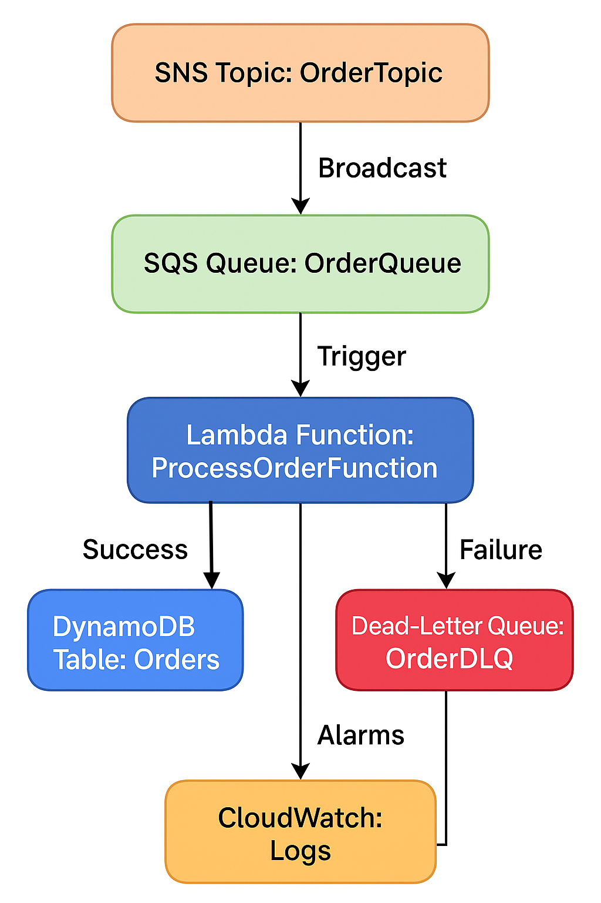

# Event-Driven Order Notification System Using AWS

This document outlines the process I followed to build an event-driven architecture for an e-commerce platform using AWS services. The architecture involves:

- **Amazon SNS** for broadcasting notifications
- **Amazon SQS** for queuing order events
- **AWS Lambda** to process messages
- **Amazon DynamoDB** to store order data

---

## Tools Used

- **Amazon SNS**: For broadcasting notifications to all subscribed endpoints.
- **Amazon SQS**: For queuing the order events and ensuring they are processed reliably.
- **AWS Lambda**: For processing the messages and performing operations like logging and storing data.
- **Amazon DynamoDB**: For storing order data with fast, reliable, and scalable access.

---

## Step 1: DynamoDB Setup

I began by creating a **DynamoDB table** named `Orders` with the following configuration:

- **Partition Key**: `orderId` (String)
- **Attributes**:
  - `userId` (String)
  - `itemName` (String)
  - `quantity` (Number)
  - `status` (String)
  - `timestamp` (String)

After creating the table, I checked its status to ensure it was marked as **Active**. I also verified that I had the correct permissions to read and write from this table using the Lambda execution role.

---

## Step 2: SNS Topic Creation

I created an **SNS topic** named `OrderTopic` to broadcast the order notifications.

- **Topic Type**: Standard
- **Topic Name**: `OrderTopic`

After the topic was created, I copied the **Topic ARN**, which would be used later for subscribing the SQS queue to this SNS topic.

---

## Step 3: SQS Queue Creation

I set up an **SQS Standard queue** named `OrderQueue` to queue messages before they are processed by the Lambda function. To ensure reliable message handling, I also configured a **Dead Letter Queue (DLQ)**. Here’s how I set it up:

1. **Created DLQ**:
   - **Queue Name**: `OrderDLQ`

2. **Created Main Queue**:
   - **Queue Name**: `OrderQueue`
   - **DLQ Configuration**: Enabled with a reference to the `OrderDLQ`
   - **Max Receive Count**: Set to 3 to ensure messages are retried up to 3 times before being sent to the DLQ.

3. **Subscribed `OrderQueue` to the `OrderTopic` SNS topic**: This ensures that any message published to `OrderTopic` is routed to the queue for processing.

Once I set up the queue and subscriptions, I tested it by publishing a simple message to ensure it was successfully routed to the `OrderQueue`.

---

## Step 4: Lambda Function Permissions

Before setting up the **Lambda function**, I made sure the Lambda execution role had the proper permissions. Specifically, I attached the following policies to allow Lambda to interact with DynamoDB and SQS:

- **AmazonDynamoDBFullAccess** (for accessing DynamoDB)
- **AmazonSQSFullAccess** (for accessing SQS)

I added these permissions by navigating to **IAM → Roles**, selecting the Lambda execution role, and then attaching the necessary policies.

---

## Step 5: Lambda Function Setup

I created a **Lambda function** named `ProcessOrderFunction` with Python 3.12 as the runtime. The function was configured to trigger whenever a new message was added to the `OrderQueue` SQS queue.

### Lambda Function Code Behavior

- **Message Parsing**: The Lambda function processes incoming messages, extracting order details (e.g., `orderId`, `userId`, `itemName`, etc.).
- **Logging**: It logs each order, helping in debugging and monitoring.
- **Data Insertion**: The Lambda function stores the parsed order details into the DynamoDB `Orders` table.

I deployed the Lambda function and verified its connection to the `OrderQueue` and DynamoDB.

---

## Step 6: Testing the Flow

I tested the full system by publishing a test message to the **OrderTopic SNS topic**. Below is the JSON format for the test message:

```json
{
  "orderId": "O1234",
  "userId": "U123",
  "itemName": "Laptop",
  "quantity": 1,
  "status": "new",
  "timestamp": "2025-05-03T12:00:00Z"
}
```
After publishing the message, I confirmed that it appeared in the OrderQueue.
I then checked the Lambda logs to ensure that the order was processed correctly.
Finally, I went to the DynamoDB Orders table and verified that the new order was stored as expected.

## Architecture Diagram


## Visibility Timeout and Dead Letter Queue (DLQ) Explanation

### Visibility Timeout

I configured the **Visibility Timeout** for the SQS queue to manage message visibility during the Lambda processing. The Visibility Timeout ensures that once a message is being processed by Lambda, it is hidden from other consumers, preventing multiple Lambda executions from picking up and processing the same message. If Lambda fails to process the message within the visibility timeout, it becomes visible again in the queue for reprocessing.

I set the Visibility Timeout to a value that aligns with the expected execution time of the Lambda function. This was crucial because if the function did not process the message in the allocated time, the message could be processed again by another instance of the Lambda function, which would lead to duplicated data or incorrect results being inserted into DynamoDB.

This feature was extremely useful for my system because it prevents race conditions where multiple Lambda functions might try to process the same order data concurrently. If that happened, it could cause order duplication or inconsistent data in DynamoDB, which would be disastrous for the system's integrity. By using Visibility Timeout properly, I ensured that each message was processed exactly once and was not picked up by another Lambda function until the current one finished processing.

The **Visibility Timeout** also helped optimize system resources by ensuring that once the message was locked by a Lambda function, no additional resources were unnecessarily allocated to retrying that message until the current process was completed.

### Dead Letter Queue (DLQ)

For the **Dead Letter Queue** (DLQ), I implemented it as part of the error-handling strategy for the SQS queue. A DLQ is useful for capturing and isolating messages that fail processing after multiple retry attempts. I set the **maxReceiveCount** for the main queue to 3, meaning that if a message fails to be processed three times, it gets automatically moved to the DLQ.

This setup allowed me to ensure that any message that could not be processed by Lambda after several attempts wouldn't be lost or result in incomplete data being written to DynamoDB. Instead, the failed message would be isolated in the DLQ, where I could manually inspect the issue, analyze the reason for failure, and fix it without affecting the main order processing flow.

The DLQ was extremely useful in my scenario because it helped me handle failure scenarios in a controlled and predictable manner. Without a DLQ, failed messages would be lost, which could lead to missing data in my database or orders being improperly processed. This would be unacceptable, especially in an e-commerce environment, where accuracy and reliability are critical.

Using the DLQ allowed me to **isolate issues**, troubleshoot failures by examining the failed messages, and make necessary adjustments before retrying the messages. This ensured that messages would not keep failing in the main processing pipeline, allowing me to maintain a smooth operation in the system without data corruption.

### How These Features Were Useful for My System

- **Visibility Timeout**: 
    - Prevents **duplicate processing** by ensuring that each message is processed by only one Lambda instance at a time.
    - Protects the integrity of the DynamoDB data by avoiding **race conditions** and inconsistent data writes.
    - Helps optimize **resource allocation** by ensuring that Lambda does not pick up the same message until the previous processing attempt is completed.

- **Dead Letter Queue (DLQ)**: 
    - Ensures that no message is lost if it fails to be processed after several retries.
    - Provides a **clear error-handling process**, allowing me to inspect, troubleshoot, and fix issues related to specific messages.
    - Protects the rest of the system from failure, preventing the Lambda function from continuously retrying problematic messages and **blocking the normal flow** of order processing.

By implementing both **Visibility Timeout** and **DLQ**, I built a more **reliable and fault-tolerant system**. These features allowed the system to recover gracefully from failures, prevent data corruption, and ensure that no order data was lost during processing, which is especially important for high-value transactions like those in an e-commerce platform.

